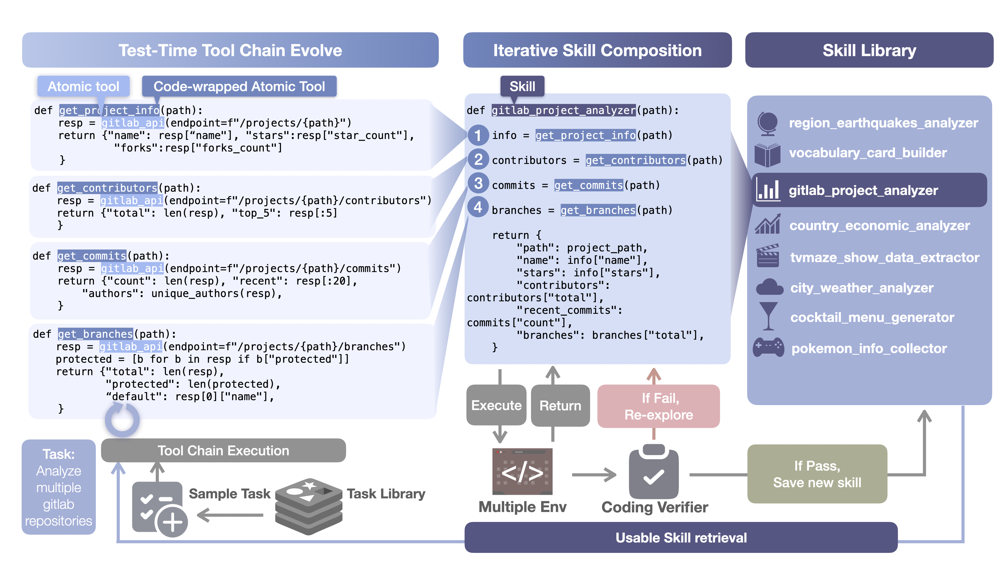

# SkillCraft

<p align="center">
  
</p>

Official implementation of the **SkillCraft** paper: [SkillCraft: Can LLM Agents Learn to Use Tools Skillfully?](https://arxiv.org/abs/2603.00718)

## Project Overview

Real-world tool-using agents operate over long-horizon workflows with recurring structure. In this setting, strong behavior depends not only on calling atomic tools, but also on discovering, abstracting, and applying higher-level tool compositions.

SkillCraft is designed to explicitly evaluate this capability. The benchmark stress-tests whether agents can form and apply higher-level tool compositions (called **Skills**) under realistic, compositional tool-use scenarios.

Task difficulty is scaled along two axes:

- **Quantitative scaling**: increase the number of entities/items an agent must process.
- **Structural scaling**: compose subtasks into longer and more complex tool-use chains.

The accompanying protocol enables agents to compose atomic tools into executable skills, cache them, and apply them across tasks as a persistent skill library. In the paper’s evaluation, this leads to substantial efficiency gains (up to 80% token reduction) while preserving strong task performance.

Project website (tasks + trajectories):

- https://skillcraft-website.github.io/page/

## Repository Layout (Reproduction-Relevant)

- `tasks/scaled_tasks/`: evaluation tasks used in the paper
- `test_all_tasks.py`: main batch evaluation entrypoint
- `run.sh`: single-task runner
- `prefix.sh`: environment loading and runtime defaults

## Reproducibility Guide

### 1. Prerequisites

- Linux (recommended)
- Python 3.10+
- `uv` package manager
- Valid LLM API endpoint/key (e.g., OpenRouter-compatible)
- Docker/Podman (recommended for environment consistency)

Install `uv` if needed:

```bash
curl -LsSf https://astral.sh/uv/install.sh | sh
```

### 2. Install dependencies

From repo root:

```bash
uv sync
```

### 3. Configure environment

Create `.env` in repo root (or export env vars in shell):

```bash
TOOLATHLON_OPENAI_API_KEY=YOUR_API_KEY
TOOLATHLON_OPENAI_BASE_URL=https://openrouter.ai/api/v1
TOOLATHLON_MODEL=deepseek-v3.2-exp
TOOLATHLON_PROVIDER=openrouter
```

`prefix.sh` will load `.env` automatically.

### 4. Running the Pipeline


### A. Run Single task

Base mode:

```bash
bash run.sh scaled_tasks/cat-facts-collector/e1 base --model deepseek-v3.2-exp --provider openrouter
```

Skill mode:

```bash
bash run.sh scaled_tasks/cat-facts-collector/e1 skill --model deepseek-v3.2-exp --provider openrouter
```

### B. Complete Evaluation (base + skill)

Main command for reproducing the complete scaled-task pipeline:

```bash
uv run python test_all_tasks.py \
  --scaled-tasks \
  --mode base,skill \
  --model deepseek-v3.2-exp \
  --provider openrouter
```

### C. Resume an interrupted run

```bash
uv run python test_all_tasks.py \
  --continue-run test_runs/run_YYYYMMDD_HHMMSS \
  --scaled-tasks \
  --mode base,skill \
  --model deepseek-v3.2-exp \
  --provider openrouter
```

## Expected Outputs

Each run produces a timestamped folder under `test_runs/`, including:

- `run_info.json`
- `test_results_<provider>_<model>.json`
- `summary_<provider>_<model>.json`
- `dumps_base_test/...` (base trajectories)
- `dumps_skill_test/...` (skill trajectories)

For result validation, check:

1. Mode-level summary in `summary_*.json`
2. Per-task `eval_res.json`
3. Per-task `traj_log.json` completeness and tool call traces

## Citation

If you use this repository, please cite the SkillCraft paper:

```bibtex
@misc{chen2026skillcraftllmagentslearn,
      title={SkillCraft: Can LLM Agents Learn to Use Tools Skillfully?},
      author={Shiqi Chen and Jingze Gai and Ruochen Zhou and Jinghan Zhang and Tongyao Zhu and Junlong Li and Kangrui Wang and Zihan Wang and Zhengyu Chen and Klara Kaleb and Ning Miao and Siyang Gao and Cong Lu and Manling Li and Junxian He and Yee Whye Teh},
      year={2026},
      eprint={2603.00718},
      archivePrefix={arXiv},
      primaryClass={cs.CL},
      url={https://arxiv.org/abs/2603.00718},
}
```
